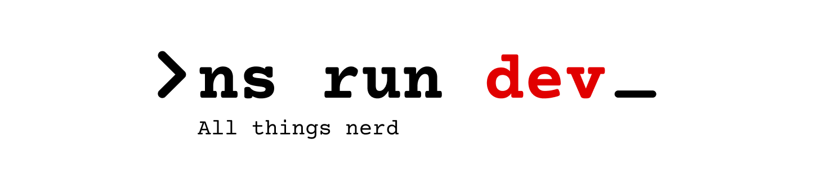

Hey! Nick's here.

I'm a principal software engineer and a big times nerd about all sorts of stuff.

You can find out more about me here:
- [YouTube](https://youtube.com/@NSKriabinDev)
- [Telegram Channel](https://t.me/nick_skriabeen)
- [X](https://x.com/nick_skriabin)

I'm also a freelancer, so if you need a robust web app, hit me up!
- [Contra](https://contra.com/nick_skriabin_a0upqrro)

Useful stuff:
- [.dotfiles](https://github.com/nick-skriabin/dotfiles);
- [QMK config](https://github.com/nick-skriabin/qmk-config);
- My Neovim plugins:
  * [commitment.nvim](github.com/nick-skriabin/commitment.nvim) - never forget to commit your changes ever again
  * [timeline.nvim](github.com/nick-skriabin/timeline.nvim) - timestamps for script writers in your md files
