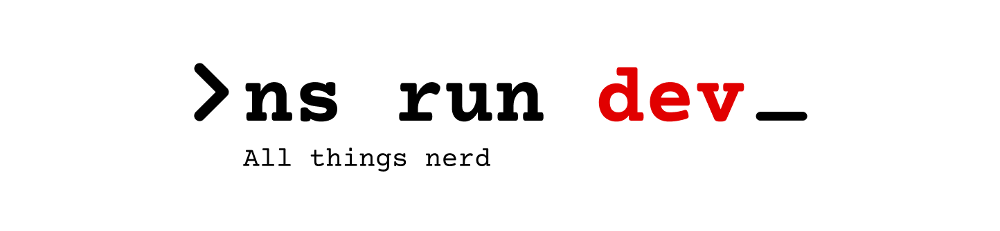

**Principal Software Engineer & All Things Nerd**

---

### 👋 Hey! Nick's here.

I'm a principal software engineer and a big time nerd about all sorts of stuff. I love building TUI apps, tinkering with Neovim, crafting custom keyboard firmware, and writing TypeScript for fun and profit. If it runs in a terminal — I'm probably into it.

---

### 📦 Open Source Projects

| Project | Description |
|---------|-------------|
| 🌿 [enva](https://github.com/nick-skriabin/enva) | Per-directory env variables with auto load/unload and nice TUI |
| 🔐 [relic](https://github.com/nick-skriabin/relic) | JS/TS secret manager for Edge and Node runtimes inspired by Rails Secrets |
|  ✍️ [Glyph](https://github.com/semos-labs/glyph) | Write TUI apps in React with the power of flexbox provided by Yoga |
| 📅 [Aion](https://github.com/semos-labs/aion) | TUI keyboard-driven Google Calendar |
| 📨 [Epist](https://github.com/semos-labs/epist) | Gmail Client for your terminal |
| 💻 [Attyx](https://github.com/semos-labs/attyx) | Fast and tiny GPU-accelerated terminal emulator written in Zig |

### 🧩 Neovim Plugins

| Plugin | Description |
|--------|-------------|
| 💾 [commitment.nvim](https://github.com/nick-skriabin/commitment.nvim) | Never forget to commit your changes ever again |
| ⏱️ [timeline.nvim](https://github.com/nick-skriabin/timeline.nvim) | Timestamps for script writers in your md files |

### ⚙️ Configs

| Repo | Description |
|------|-------------|
| 🗂️ [.dotfiles](https://github.com/nick-skriabin/dotfiles) | My dotfiles |
| ⌨️ [QMK config](https://github.com/nick-skriabin/qmk-config) | Custom keyboard firmware config |
